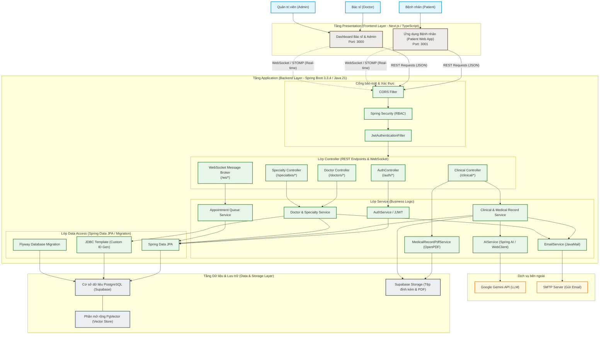

# Sơ đồ Kiến trúc Hệ thống MediCore EMR (System Architecture Diagram)

Hệ thống **MediCore EMR** được thiết kế và phát triển theo mô hình **Client-Server** kết hợp với **Kiến trúc phân lớp (Layered Architecture)**. Cấu trúc này giúp phân tách rõ ràng trách nhiệm giữa giao diện người dùng, logic nghiệp vụ, và lưu trữ dữ liệu, nâng cao tính bảo mật, hiệu năng và khả năng mở rộng.

---

## 1. Sơ đồ Kiến trúc dạng hình ảnh (PNG Diagram)

---

## 2. Sơ đồ Kiến trúc chi tiết (Mermaid Diagram)

Dưới đây là sơ đồ luồng kiến trúc từ tác nhân sử dụng, qua các lớp frontend, gateway bảo mật, xử lý nghiệp vụ backend, cho đến tích hợp dịch vụ bên ngoài và cơ sở dữ liệu.

---

## 2. Chi tiết các thành phần trong Kiến trúc

### 2.1. Lớp Trình diễn (Frontend Presentation Layer)
Được viết bằng **Next.js (App Router)** và **TypeScript**, bao gồm hai ứng dụng riêng biệt chạy trên các cổng khác nhau:
*   **Patient Web App (Port 3001):** Dành riêng cho bệnh nhân. Cho phép đăng ký/đăng nhập, tìm kiếm bác sĩ, chuyên khoa, đặt lịch khám, theo dõi hàng chờ thời gian thực và xem lại lịch sử bệnh án (`/clinical/medical-records/me`).
*   **Doctor & Admin Dashboard (Port 3000):** Dành cho bác sĩ và quản trị viên.
    *   *Bác sĩ:* Quản lý hàng chờ bệnh nhân, tiến hành khám bệnh, nhập kết quả bệnh án, kê đơn thuốc và tải xuống file PDF bệnh án.
    *   *Quản trị viên:* Cấu hình thông tin bác sĩ, chuyên khoa, quản lý tài khoản và giám sát toàn bộ hệ thống.

### 2.2. Lớp Ứng dụng (Backend Application Layer)
Được xây dựng trên **Spring Boot 3.3.4** và **Java 21**, vận hành theo cấu trúc phân lớp truyền thống:
1.  **Cổng Bảo mật (Spring Security & JWT):**
    *   `CORS Filter`: Cấu hình cho phép các nguồn gốc (Origins) xác định truy cập API, hỗ trợ đầy đủ các phương thức HTTP bao gồm `GET`, `POST`, `PUT`, `PATCH`, `DELETE`, `OPTIONS`.
    *   `JwtAuthenticationFilter`: Chặn và xác thực JWT token từ Header `Authorization` (Bearer token) của request gửi lên.
    *   `Spring Security`: Áp dụng phân quyền phân vai trò (Role-Based Access Control) chặt chẽ bằng cách sử dụng `@PreAuthorize` hoặc cấu hình các requestMatchers (`ADMIN`, `DOCTOR`, `PATIENT`).
2.  **Lớp Controller (REST APIs & WebSocket Message Broker):**
    *   Cung cấp các API RESTful định dạng JSON.
    *   Tích hợp WebSocket Broker qua giao thức **STOMP (SockJS)** phục vụ cập nhật trạng thái lịch hẹn khám và cập nhật số thứ tự xếp hàng thời gian thực.
3.  **Lớp Service (Business Logic):**
    *   `AuthService`: Xử lý đăng ký, đăng nhập, và tạo JWT.
    *   `Clinical & Medical Record Service`: Logic quản lý lịch sử khám bệnh, ghi nhận kết quả và chẩn đoán.
    *   `Queue Service`: Quản lý logic hàng chờ gọi số của bệnh nhân tại các phòng khám.
    *   `MedicalRecordPdfService`: Kết xuất đơn thuốc và hồ sơ bệnh án sang PDF thông qua thư viện OpenPDF/iText.
    *   `AIService`: Điều phối việc gọi mô hình ngôn ngữ lớn (Gemini API) thông qua WebClient để phân tích chẩn đoán hỗ trợ bác sĩ và lưu vết (`DoctorAiConsultationLog`).
4.  **Lớp Repository (Data Access Layer):**
    *   Sử dụng **Spring Data JPA** để ánh xạ thực thể (ORM - Hibernate) giúp thao tác với cơ sở dữ liệu nhanh chóng.
    *   Dùng **JDBC Template** cho các truy vấn tối ưu hiệu năng hoặc tự động sinh mã định danh có định dạng phức tạp (như `DOC-yyyy-xxxx` hay `PAT-yyyy-xxxx`).
    *   Tích hợp **Flyway Migration** để tự động chạy các script cập nhật cấu trúc bảng (schema) đồng bộ giữa các môi trường.

### 2.3. Lớp Dữ liệu & Lưu trữ (Data & Storage Layer)
*   **PostgreSQL (Supabase):** Hệ quản trị cơ sở dữ liệu chính. Lưu trữ toàn bộ dữ liệu quan hệ (Người dùng, Bác sĩ, Chuyên khoa, Lịch hẹn, Bệnh án, Đơn thuốc).
*   **PgVector Extension:** Hỗ trợ lưu trữ các vector embeddings được trích xuất từ dữ liệu tri thức y khoa. Phục vụ cho công cụ tìm kiếm ngữ nghĩa và trợ lý AI (RAG - Retrieval-Augmented Generation).
*   **Supabase Storage:** Dịch vụ Object Storage tích hợp của Supabase, dùng để lưu trữ các tệp tin đính kèm như hình ảnh chụp chiếu (X-Ray, siêu âm) và các file PDF kết quả khám bệnh đã được kết xuất.

---

## 3. Luồng dữ liệu chính trong hệ thống (Data Flows)

### 3.1. Luồng Xác thực (Authentication Flow)
1. Client gửi request đăng nhập (`POST /auth/login`) với username/password.
2. `SecurityConfig` cho phép qua tự do (permitAll).
3. `AuthController` nhận request và gọi `AuthService` xác thực thông tin đăng nhập bằng `AuthenticationManager`.
4. Nếu thành công, sinh ra một JWT token mã hóa các thông tin: `userId`, `roles`.
5. Trả token về client. Các request sau đó của Client sẽ kèm token này vào Header `Authorization: Bearer <token>`.

### 3.2. Luồng Gọi số & Hàng chờ thời gian thực (Real-time Queue Flow)
1. Bệnh nhân đặt lịch thành công, trạng thái lịch hẹn chuyển sang "Chờ khám".
2. Hệ thống cập nhật cơ sở dữ liệu và gửi thông báo qua WebSocket Broker (`/ws/*`).
3. Dashboard của Bác sĩ lắng nghe qua kênh STOMP tương ứng sẽ nhận tín hiệu và tự động cập nhật danh sách hàng chờ khám tức thì mà không cần tải lại trang (reload).

### 3.3. Luồng Tạo Hồ sơ bệnh án & Kết xuất PDF (EMR & PDF Export Flow)
1. Bác sĩ hoàn thành khám bệnh và gửi thông tin chẩn đoán, thuốc lên backend (`POST /clinical/medical-records`).
2. `ClinicalService` lưu trữ thông tin bệnh án vào PostgreSQL.
3. Sau đó, gọi `MedicalRecordPdfService` để tạo file PDF đơn thuốc/bệnh án từ template HTML (sử dụng Thymeleaf và OpenPDF).
4. File PDF được tạo và có thể tùy chọn upload lưu trữ lên Supabase Storage và trả lại đường dẫn cho Client để hiển thị hoặc in.
