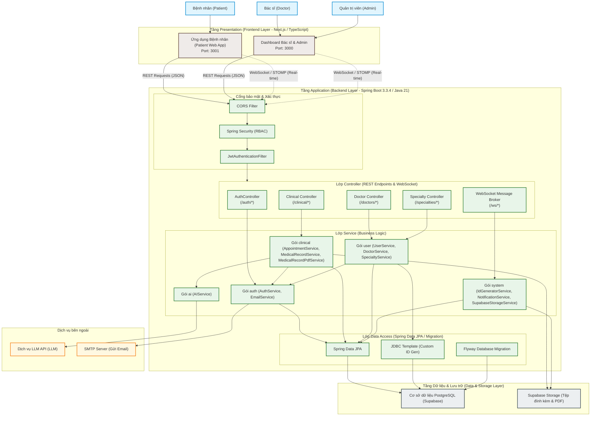

# Sơ đồ Kiến trúc Hệ thống MediCore EMR (System Architecture Diagram)

Hệ thống **MediCore EMR** được thiết kế và phát triển theo mô hình **Client-Server** kết hợp với **Kiến trúc phân lớp (Layered Architecture)**. Cấu trúc này giúp phân tách rõ ràng trách nhiệm giữa giao diện người dùng, logic nghiệp vụ, và lưu trữ dữ liệu, nâng cao tính bảo mật, hiệu năng và khả năng mở rộng.

---

## 1. Sơ đồ Kiến trúc dạng hình ảnh (PNG Diagram)

---

## 2. Sơ đồ Kiến trúc chi tiết (Mermaid Diagram)

Dưới đây là sơ đồ luồng kiến trúc từ tác nhân sử dụng, qua các lớp frontend, gateway bảo mật, xử lý nghiệp vụ backend, cho đến tích hợp dịch vụ bên ngoài và cơ sở dữ liệu.

---

## 2. Chi tiết các thành phần trong Kiến trúc

*   **Tầng 1 - Frontend Presentation Layer (Giao diện):** Chúng em tách biệt hoàn toàn thành 2 ứng dụng độc lập: Patient Web App (chạy trên Port 3001) dành cho bệnh nhân và Doctor & Admin Web App (chạy trên Port 3000) phục vụ nội bộ. Sự tách biệt này giúp tối ưu trải nghiệm người dùng và dễ dàng mở rộng (scale) độc lập sau này.
*   **Tầng 2 - Backend Application Layer (Xử lý logic):** Sử dụng Spring Boot làm nhân cốt lõi để xử lý các User requests. Luồng yêu cầu đi qua API Gateway, được bảo mật chặt chẽ bởi Spring Security và xác thực qua cơ chế mã hóa JWT. Tại lớp điều hướng REST Controllers & WebSocket Broker, chúng em tích hợp WebSocket để đẩy dữ liệu trạng thái hàng chờ thời gian thực đến giao diện bệnh nhân.
    
    Tiến vào lớp Service Layer, chúng em chia mã nguồn thành các gói nghiệp vụ phân tách rõ ràng bao gồm: ai, auth, clinical, system và user. Một điểm đặc biệt là hệ thống kết nối tương tác với **LLM API** (đóng vai trò External AI Service) và SMTP Mail Server (phục vụ Email Notifications) thông qua cơ chế bất đồng bộ (Asynchronous), giúp trải nghiệm tư vấn của Trợ lý AI và gửi mail nhắc nhở luôn mượt mà, không gây nghẽn hệ thống. Qua tầng giao tiếp Data Access Layer (JPA, Flyway), dữ liệu sẽ được đồng bộ xuống tầng cuối cùng.
*   **Tầng thứ 3 - Database & Storage Layer:** Hệ thống tối giản và tối ưu hóa hạ tầng lưu trữ thành hai thành phần cốt lõi: Lưu trữ toàn bộ dữ liệu quan hệ, thông tin người dùng và lịch sử khám bệnh tại PostgreSQL (Supabase), đồng thời quản lý, lưu trữ toàn bộ các tệp tin y tế hay tệp PDF đơn thuốc một cách an toàn, bảo mật thông qua Supabase Object Storage.

---

## 3. Luồng dữ liệu chính trong hệ thống (Data Flows)

### 3.1. Luồng Xác thực (Authentication Flow)
1. Client gửi request đăng nhập (`POST /auth/login`) với username/password.
2. `SecurityConfig` cho phép qua tự do (permitAll).
3. `AuthController` nhận request và gọi `AuthService` xác thực thông tin đăng nhập bằng `AuthenticationManager`.
4. Nếu thành công, sinh ra một JWT token mã hóa các thông tin: `userId`, `roles`.
5. Trả token về client. Các request sau đó của Client sẽ kèm token này vào Header `Authorization: Bearer <token>`.

### 3.2. Luồng Gọi số & Hàng chờ thời gian thực (Real-time Queue Flow)
1. Bệnh nhân đặt lịch thành công, trạng thái lịch hẹn chuyển sang "Chờ khám".
2. Hệ thống cập nhật cơ sở dữ liệu và gửi thông báo qua WebSocket Broker (`/ws/*`).
3. Dashboard của Bác sĩ lắng nghe qua kênh STOMP tương ứng sẽ nhận tín hiệu và tự động cập nhật danh sách hàng chờ khám tức thì mà không cần tải lại trang (reload).

### 3.3. Luồng Tạo Hồ sơ bệnh án & Kết xuất PDF (EMR & PDF Export Flow)
1. Bác sĩ hoàn thành khám bệnh và gửi thông tin chẩn đoán, thuốc lên backend (`POST /clinical/medical-records`).
2. `ClinicalService` lưu trữ thông tin bệnh án vào PostgreSQL.
3. Sau đó, gọi `MedicalRecordPdfService` để tạo file PDF đơn thuốc/bệnh án từ template HTML (sử dụng Thymeleaf và OpenPDF).
4. File PDF được tạo và có thể tùy chọn upload lưu trữ lên Supabase Storage và trả lại đường dẫn cho Client để hiển thị hoặc in.
