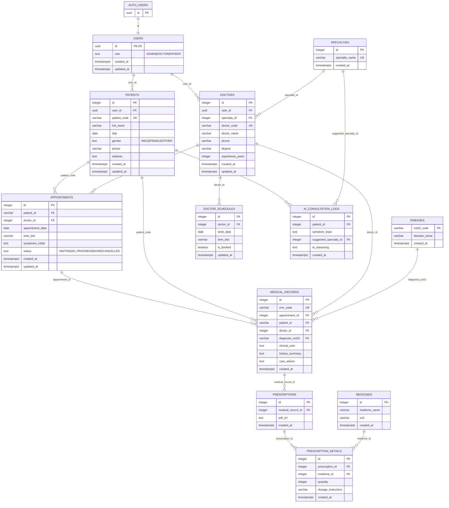

# MediCore Database ERD

Source: live Supabase PostgreSQL public schema (`pabogdocgaqzxfehrbhc`).

Last verified: 2026-06-22.

> Reference only. This ERD documents current database structure. It does not apply migrations.

## Mermaid ERD

## Relationship notes

| From | To | Note |
|---|---|---|
| `public.users.id` | `auth.users.id` | `auth.users` is managed by Supabase Auth. |
| `public.patients.user_id` | `public.users.id` | `ON DELETE CASCADE`. |
| `public.doctors.user_id` | `public.users.id` | `ON DELETE CASCADE`. |
| `public.doctors.specialty_id` | `public.specialties.id` | Doctor belongs to one specialty. |
| `public.appointments.patient_id` | `public.patients.patient_code` | Uses business key, not numeric patient id. |
| `public.medical_records.patient_id` | `public.patients.patient_code` | Uses business key, not numeric patient id. |
| `public.ai_consultation_logs.patient_id` | `public.patients.id` | Uses numeric patient id. |
| `public.prescription_details.medicine_id` | `public.medicines.id` | Prescription line item references medicine catalog. |

## Constraints and indexes

- Primary keys exist on every table.
- Unique constraints:
  - `specialties.specialty_name`
  - `patients.patient_code`
  - `doctors.doctor_code`
  - `medical_records.emr_code`
- Check constraints:
  - `users.role in ('ADMIN', 'DOCTOR', 'PATIENT')`
  - `patients.gender in ('MALE', 'FEMALE', 'OTHER')`
  - `appointments.status in ('WAITING', 'IN_PROGRESS', 'DONE', 'CANCELLED')`
- Helper indexes:
  - `idx_patients_code`
  - `idx_doctors_code`
  - `idx_appointments_date`
  - `idx_appointments_status`
  - `idx_medical_records_emr`

## Known backend mapping mismatches

Current live DB differs from some JPA entities:

- `public.users.id` is `uuid` and references `auth.users.id`; backend `User` extends `BaseEntity<Long>`.
- `public.users` stores `role` only; backend `User` currently includes `email`, `password`, and `is_active`.
- `public.patients.phone` differs from backend `Patient.phoneNumber` mapped to `phone_number`.
- `appointments.patient_id` and `medical_records.patient_id` reference `patients.patient_code`, while `ai_consultation_logs.patient_id` references `patients.id`.

Aligning JPA entities with this live schema should be separate work.
